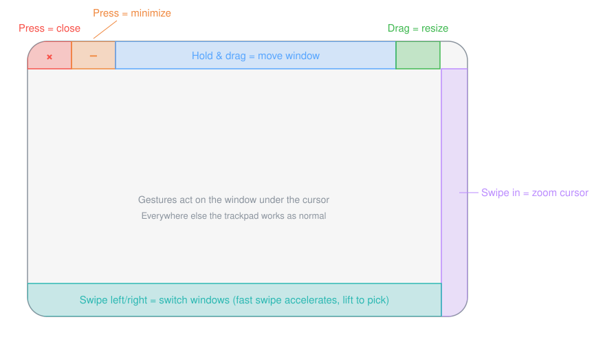

# trackpad_pro

[中文](README.md) | English

Turn your trackpad into a window remote: press or drag in dedicated trackpad zones to close, minimize, move, and resize the window **under your cursor** — no need to focus it first, no need to aim at the traffic-light buttons. macOS 13+, free and open source (MIT).



| Gesture | Action |
|---|---|
| Press the **top-left corner** of the trackpad | Red overlay appears on the window; **release** to close it; slide your finger while pressing to cancel |
| Press the zone **right of the top-left corner** | Orange overlay; **release** to minimize; slide to cancel (the layout mirrors the traffic lights: red = close, yellow = minimize) |
| Press and drag along the **top edge** | Blue overlay; the window follows your finger |
| Press and drag the **top-right corner** | Green overlay; drag to resize (mapped to the window's bottom-right corner: drag down-right = larger) |
| Swipe inward from the **right edge** with one finger | Cursor zooms (3× by default), restores when you lift your finger. For when you've lost the pointer |
| Swipe left/right along the **bottom edge** with one finger | A switcher bar appears at the bottom of the screen; windows are brought to the front one by one in stacking order as you swipe — faster swipes accelerate (up to 4×); **lift your finger to pick** the current window |

Gestures act on the **window under the mouse cursor** (it does not need to be frontmost).
When there is no regular window under the cursor (desktop, menu bar, Dock, …), gestures don't trigger and events pass through untouched — exactly as if the tool weren't installed.

The UI (menus, settings, tutorial, overlays) follows your system language: English everywhere, Chinese on Chinese-language systems.

## Install

**Option 1: download a Release**

Download the zip from [Releases](https://github.com/g03024735/trackpad_pro/releases), unzip it into /Applications, then remove the quarantine flag:

```bash
xattr -cr /Applications/trackpad_pro.app
```

> Why this step: the project isn't notarized (no paid Apple developer account), so macOS
> marks the downloaded app as "damaged" or "unverified". `xattr -cr` removes the download
> quarantine flag so it opens normally. If you'd rather not — the code is fully open,
> build it yourself with Option 2.

**Option 2: build from source**

```bash
git clone https://github.com/g03024735/trackpad_pro.git
cd trackpad_pro
./build_app.sh --install
```

**Upgrading:** the app is ad-hoc signed, so each upgrade invalidates the previous
Accessibility grant (the toggle still shows enabled but no longer works). On launch the
app detects this and shows its permission panel — just toggle the switch off and on.

## Privacy

No network access, no data collection. Touch and mouse events are processed entirely on
your machine; the code is auditable.

## UI

- **Menu bar icon**: left-click pauses/resumes gestures (the icon dims while paused), right-click opens the menu (settings, quit)
- **Settings window**: a live trackpad diagram at the top shows every zone and your current finger position — **drag the white handles on the diagram to resize zones**; each gesture can be toggled individually, and the switcher direction is configurable
- **Interactive tutorial**: opens automatically after first authorization — 6 steps (welcome → move → resize → cursor zoom → minimize → close), practiced on the tutorial window itself; each step advances when you perform it correctly, and closing the window with the gesture finishes the tutorial. While the tutorial is open, close/minimize gestures only affect the tutorial window, so your real windows are safe. Re-open it any time from settings, or launch with `--reset-onboarding`
- **Launch at login**: enabled by default on the first run as an .app; turn it off in settings — you can always relaunch from /Applications or Spotlight

## How it works

- `MultitouchSupport.framework` (private): reads each finger's normalized trackpad coordinates globally.
- `CGEventTap`: intercepts mouse down/drag/up; swallows the event when a gesture zone is hit.
- Accessibility (`AXUIElement`): presses the window's close button / sets window position and size.
- `CGSSetCursorScale` from `SkyLight.framework` (private): temporarily scales the system cursor; the original scale is stored in UserDefaults while zoomed, so it is restored on next launch even after a crash.

## Build & run

```bash
swift build -c release
.build/release/trackpad_pro
```

On first run a guide panel appears (instead of the system permission dialog). Click
"Open System Settings" and enable `trackpad_pro` under Privacy & Security →
Accessibility; the app detects the grant, relaunches itself, and continues.

Add `--debug` when tuning thresholds — it prints live finger coordinates
(x: 0 left → 1 right, y: 0 bottom → 1 top) and gesture logs:

```bash
.build/release/trackpad_pro --debug
```

## Configuration

Everything adjustable in the settings window persists to UserDefaults (key `config`).
Defaults live in `Sources/trackpad_pro/Config.swift`:

- `topEdgeHeight` (default 0.10): uniform height of the top gesture strip (close/minimize/move/resize)
- `closeZoneWidth` (default 0.10): close zone width, flush with the left edge
- `minimizeZoneWidth` (default 0.10): minimize zone width, immediately right of the close zone (i.e. 10%–20%)
- `cornerSize` (default 0.10): width of the top-right (resize) corner
- `requireSingleFinger` (default true): only trigger with a single finger on the pad
- `tapFallbackInterval` (default 0.25s): for tap-to-click, how far back to look up the finger that just lifted
- `closeCancelDistance` (default 10px): moving beyond this distance after pressing in the close/minimize zone cancels the action
- `cursorZoomEnabled` (default true) / `rightEdgeWidth` (0.06) / `edgeSwipeActivationDistance` (0.04) / `cursorZoomScale` (3.0): right-edge swipe cursor zoom
- `switcherEnabled` (default true) / `bottomEdgeHeight` (0.12) / `switcherStepDistance` (0.055 — distance per window at slow speed; fast swipes accelerate up to 4×) / `switcherRightToNext` (true — swipe right for the next window): bottom-edge window switcher

## Packaging as .app

A bare command-line binary's Accessibility grant is attributed to the terminal that
launched it; packaged as an .app it has its own identity:

```bash
./build_app.sh
open dist/trackpad_pro.app --args --debug
tail -f ~/Library/Logs/trackpad_pro.log
pkill -x trackpad_pro     # quit
```

The ad-hoc signature changes on every rebuild, invalidating the old grant.
`build_app.sh` runs `tccutil reset Accessibility local.trackpad-pro` automatically to
clear the stale record; the next `open` shows the permission panel — just re-enable the
toggle. Signing with a self-created certificate
(`CODESIGN_IDENTITY="Cert Name" ./build_app.sh`) keeps the grant across rebuilds.

## Development / testing helpers

- `--overlay-demo`: previews the feedback overlays at a fixed screen position (no permissions needed)
- `--show-settings` / `--show-onboarding`: opens the settings / tutorial window directly on launch
- Environment variable `TRACKPAD_PRO_FAKE_FINGER="x,y"`: treats every click as a finger at those normalized coordinates — combined with synthesized mouse events this exercises the whole pipeline without real touches

## Code layout

```
Sources/CMultitouch/include/CMultitouch.h   private-framework structs & prototypes
Sources/trackpad_pro/Finger.swift           touch data structure
Sources/trackpad_pro/TouchTracker.swift     reads & caches touches
Sources/trackpad_pro/EdgeSwipeDetector.swift right-edge swipe detection (pure logic)
Sources/trackpad_pro/CursorZoom.swift       cursor zoom / restore
Sources/trackpad_pro/GestureController.swift event tap + gesture detection
Sources/trackpad_pro/WindowControl.swift    AX window operations
Sources/trackpad_pro/FeedbackOverlay.swift  gesture feedback overlays
Sources/trackpad_pro/PermissionWindow.swift Accessibility permission guide panel
Sources/trackpad_pro/SettingsStore.swift    config persistence & change notifications
Sources/trackpad_pro/StatusBarController.swift menu bar icon & menu
Sources/trackpad_pro/TrackpadDiagram.swift  trackpad diagram (shared by settings/tutorial)
Sources/trackpad_pro/SettingsWindow.swift   settings window
Sources/trackpad_pro/OnboardingWindow.swift tutorial window & animations
Sources/trackpad_pro/WindowSwitcher.swift   bottom-edge window switcher + switcher HUD
Sources/trackpad_pro/GestureEvents.swift    gesture-completed events (tutorial subscribes)
Sources/trackpad_pro/L10n.swift             bilingual strings (follows system language)
Sources/trackpad_pro/Config.swift           thresholds
Sources/trackpad_pro/main.swift             entry point, permissions, single-instance lock
```

## License

[MIT](LICENSE)
