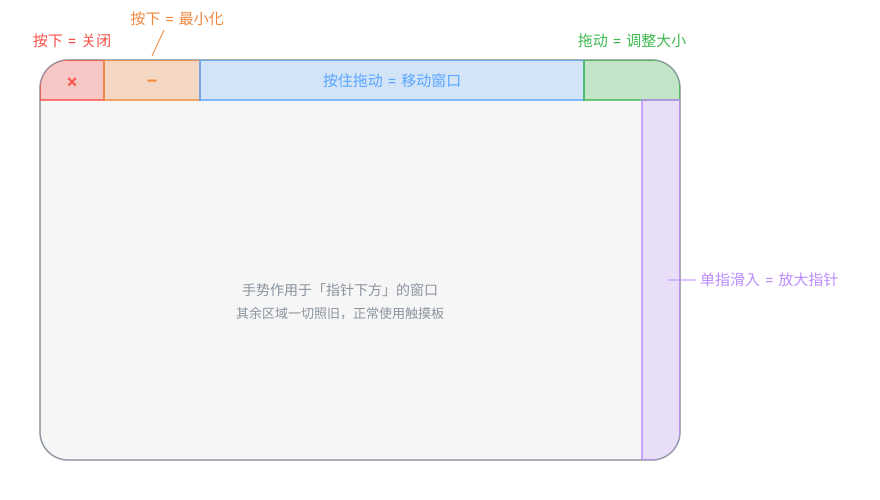

# trackpad_pro

中文 | [English](README.en.md)

把触摸板变成窗口遥控器：在触摸板的不同分区按下/拖动，直接关闭、最小化、移动、缩放**指针下方**的窗口——不用先点聚焦，不用找红绿灯按钮。macOS 13+，开源免费（MIT）。



| 手势 | 动作 |
|---|---|
| 在触摸板**左上角**按下 | 窗口盖上红色提示层；**松开**关闭窗口；按住时移动手指则取消 |
| 在**左上角右侧一格**按下 | 窗口盖上橙色提示层；**松开**最小化窗口；按住时移动手指则取消（布局对应红绿灯：红=关闭，黄=最小化） |
| 在触摸板**上沿**按下并拖动 | 窗口盖上蓝色提示层，随手指移动 |
| 在触摸板**右上角**按下并拖动 | 窗口盖上绿色提示层，拖动调整窗口大小（映射到窗口右下角：向右下拖 = 放大） |
| 单指从触摸板**右边缘**起手向内滑动 | 指针放大（默认 3 倍），手指抬起即还原。用于找不到指针时 |

手势作用于**鼠标指针下方的窗口**（不要求该窗口或应用处于前台）。
指针下没有普通窗口时（桌面、菜单栏、Dock 等），手势不触发、事件原样放行，和没装本工具时一样。
想改成作用于前台聚焦窗口，把 `Config.targetUnderCursor` 设为 `false`。

## 安装

**方式一：下载 Release**

从 [Releases](https://github.com/g03024735/trackpad_pro/releases) 下载 zip，解压放入 /Applications，然后解除隔离：

```bash
xattr -cr /Applications/trackpad_pro.app
```

> 为什么需要这一步：本项目未做 Apple 付费签名公证，macOS 会把下载的 app 标记为
> "已损坏"或"无法验证"。`xattr -cr` 移除下载隔离标记后即可正常打开。
> 不放心的话——代码全部开源，也可以用方式二自己编译。

**方式二：源码构建**

```bash
git clone https://github.com/g03024735/trackpad_pro.git
cd trackpad_pro
./build_app.sh --install
```

**升级须知**：本项目使用 ad-hoc 签名，每次升级后旧的辅助功能授权会失效
（开关显示已勾选但不生效）。启动后 app 会自动弹出引导面板，把开关关掉再打开即可。

## 隐私

不联网、不采集任何数据。触摸和鼠标事件只在本机处理，代码可审计。

## 界面

- **菜单栏图标**：运行状态、暂停手势、设置、引导教学、开机自动启动、退出
- **设置窗口**：顶部触摸板示意图实时显示各功能区和你当前的手指位置；每个手势可单独开关、调整区域大小
- **引导教学**：首次授权后自动弹出，5 步（欢迎 → 移动 → 放大指针 → 最小化 → 关闭），操作对象就是教学窗口本身，做对自动进入下一步。菜单栏可随时重看，或 `--reset-onboarding` 启动

## 原理

- `MultitouchSupport.framework`（私有框架）：全局读取每根手指在触摸板上的归一化坐标。
- `CGEventTap`：拦截鼠标按下/拖动/抬起；命中手势时吞掉事件。
- Accessibility (`AXUIElement`)：按窗口关闭按钮 / 设置窗口位置。
- `SkyLight.framework`（私有）的 `CGSSetCursorScale`：临时放大系统指针；放大期间把原倍率记在 UserDefaults，异常退出后下次启动自动还原。

## 构建与运行

```bash
swift build -c release
.build/release/trackpad_pro
```

首次运行会显示一个引导面板（不使用系统的授权弹窗），点「打开系统设置」后在
隐私与安全性 → 辅助功能 里打开 `trackpad_pro` 的开关；程序检测到授权后自动重启并继续。

调阈值时加 `--debug`，会实时打印手指坐标（x 0 左→1 右，y 0 下→1 上）和手势触发日志：

```bash
.build/release/trackpad_pro --debug
```

## 参数

设置窗口里可调的项会持久化到 UserDefaults（`config` 键）。默认值见 `Sources/trackpad_pro/Config.swift`：

- `cornerSize`（默认 0.15）：上沿功能区高度；也是右上角（调整大小）的宽度
- `closeZoneWidth`（默认 0.10）：关闭区宽度，贴左边缘
- `minimizeZoneWidth`（默认 0.15）：最小化区宽度，紧挨关闭区右侧（即 10%–25%）
- `topEdgeHeight`（默认 0.10）：上沿拖窗判定区域高度
- `requireSingleFinger`（默认 true）：只在单指时触发
- `tapFallbackInterval`（默认 0.25s）：轻点（tap to click）时回溯刚抬起的手指位置
- `closeCancelDistance`（默认 10px）：关闭/最小化区按下后指针移动超过此距离即取消
- `targetUnderCursor`（默认 true）：作用于指针下方窗口；false 则作用于前台聚焦窗口
- `cursorZoomEnabled`（默认 true）/ `rightEdgeWidth`（0.06）/ `edgeSwipeActivationDistance`（0.04）/ `cursorZoomScale`（3.0）：右边缘滑入放大指针

## 打包为 .app

命令行程序的辅助功能权限会归到启动它的终端名下；打包成 .app 后它有自己的身份：

```bash
./build_app.sh
open dist/trackpad_pro.app --args --debug
tail -f ~/Library/Logs/trackpad_pro.log
pkill -x trackpad_pro     # 退出
```

ad-hoc 签名每次重新打包都会变，旧授权会失效。`build_app.sh` 会自动执行
`tccutil reset Accessibility local.trackpad-pro` 清掉旧记录，下次 `open` 时显示引导面板，打开开关即可。
用自签证书（`CODESIGN_IDENTITY="证书名" ./build_app.sh`）签名则授权可跨版本保留。

## 开发/测试辅助

- `--overlay-demo`：在屏幕固定位置预览提示层外观（不需要权限）
- `--show-settings` / `--show-onboarding`：启动后直接打开设置 / 教学窗口
- 环境变量 `TRACKPAD_PRO_FAKE_FINGER="x,y"`：所有点击都视为手指在该归一化坐标，
  配合合成鼠标事件可以在没有真实触摸的情况下自动化测试整条管线

## 代码结构

```
Sources/CMultitouch/include/CMultitouch.h   私有框架结构体与函数声明
Sources/trackpad_pro/Finger.swift           触点数据结构
Sources/trackpad_pro/TouchTracker.swift     读取并缓存触点
Sources/trackpad_pro/EdgeSwipeDetector.swift 右边缘滑入检测（纯逻辑）
Sources/trackpad_pro/CursorZoom.swift       指针放大/还原
Sources/trackpad_pro/GestureController.swift 事件拦截 + 手势判定
Sources/trackpad_pro/WindowControl.swift    AX 窗口操作
Sources/trackpad_pro/FeedbackOverlay.swift  手势反馈提示层
Sources/trackpad_pro/PermissionWindow.swift 辅助功能权限引导面板
Sources/trackpad_pro/SettingsStore.swift    配置持久化与变更通知
Sources/trackpad_pro/StatusBarController.swift 菜单栏图标与菜单
Sources/trackpad_pro/TrackpadDiagram.swift  触摸板示意图（设置/教学共用）
Sources/trackpad_pro/SettingsWindow.swift   设置窗口
Sources/trackpad_pro/OnboardingWindow.swift 引导教学窗口与动画
Sources/trackpad_pro/GestureEvents.swift    手势完成事件（教学订阅）
Sources/trackpad_pro/Config.swift           阈值
Sources/trackpad_pro/main.swift             入口、权限
```

## License

[MIT](LICENSE)
